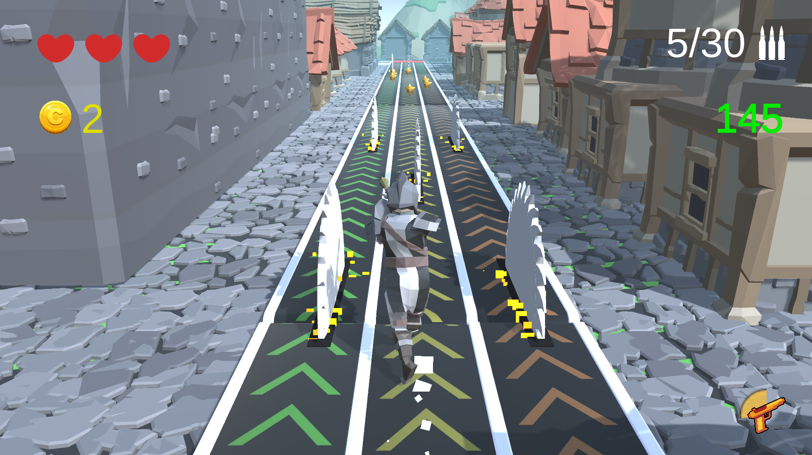

# Runner-BSG
 


# Control Scheme
# Button/ Touch Input	Action it Performs
	ЛКМ	Стрельба
	Пробел	Прыжок
	A / стрелка влево	Стрейф влево
	D / стрелка вправо	Стрейф вправо

# Game configuration
Конфиг для настройки игры находится в папке Resources.

# PC build reference
https://disk.yandex.ru/d/9BAHyUZT_pF_Fg

# Github reference
https://github.com/VintorezzZ/Network-Runner-BSG